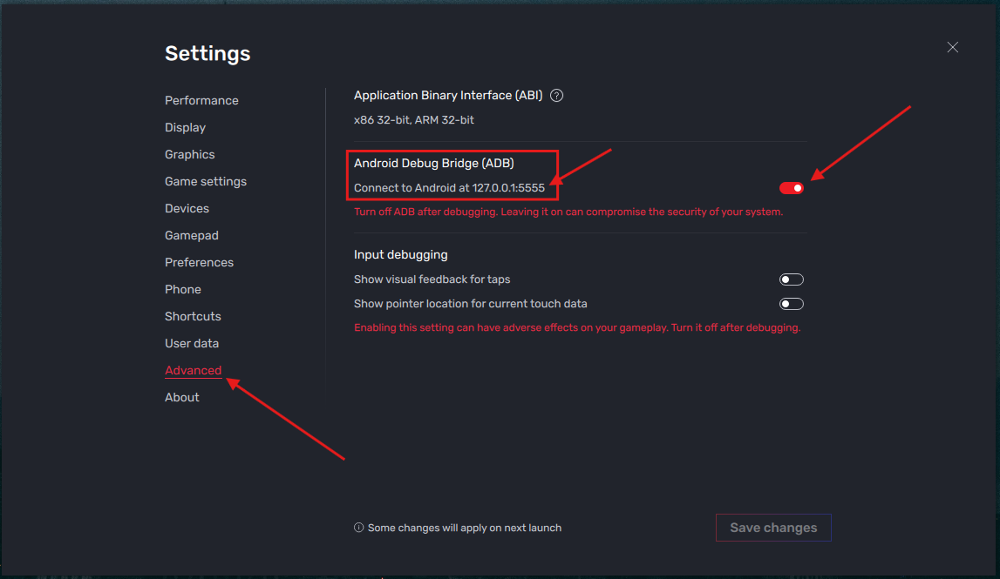
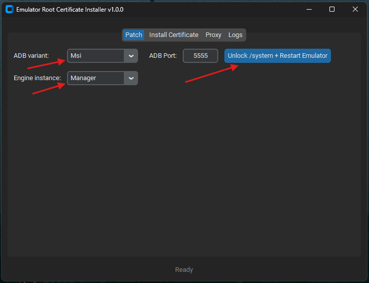
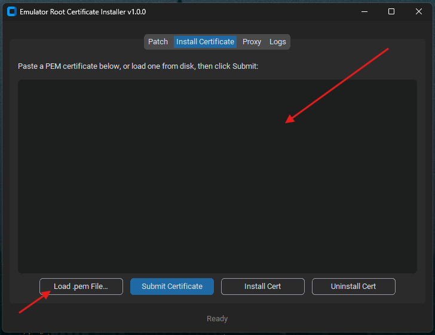
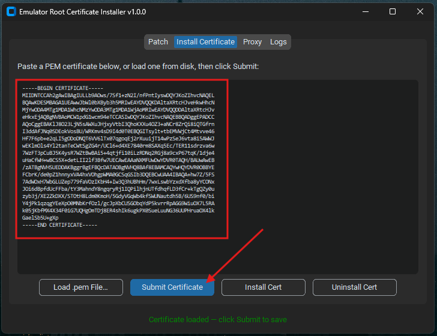
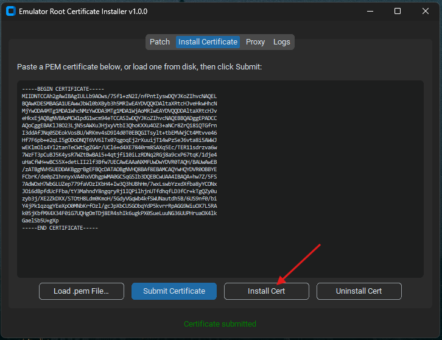
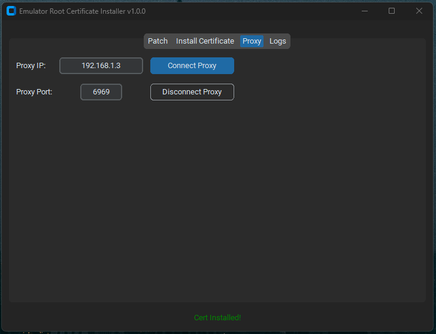
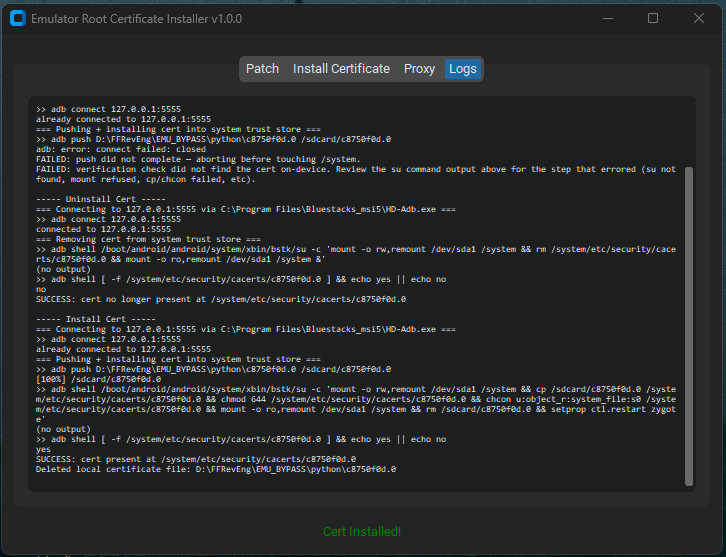

# Emulator Root Certificate Installer

**A Windows GUI tool for Android pentesting on BlueStacks** — root the emulator, install a CA certificate into the Android system trust store, and route emulator traffic through **Burp Suite**, **mitmproxy**, or any other intercepting proxy so you can inspect and monitor HTTPS traffic from Android apps.

> **Strictly for educational and authorized security-testing purposes only.**
> Use this tool only against emulators, apps, and traffic you own or have explicit written permission to test. Intercepting traffic you are not authorized to intercept may be illegal in your jurisdiction. The authors accept no liability for misuse.

---

## Table of Contents

- [What is this?](#what-is-this)
- [Why you need this](#why-you-need-this)
- [Features](#features)
- [Requirements](#requirements)
- [Download](#download)
- [Step-by-step usage](#step-by-step-usage-with-screenshots)
- [Troubleshooting](#troubleshooting)
- [Building the EXE yourself](#building-the-exe-yourself)
- [FAQ](#faq)
- [Disclaimer](#disclaimer)

---

## What is this?

**Emulator Root Certificate Installer** is a small, self-contained Windows app built for **Android application penetration testing** on the **BlueStacks Android emulator**. Modern Android apps only trust certificates from the *system* trust store for HTTPS traffic, so a proxy tool's CA certificate installed as a "user" certificate is silently ignored by most apps. This tool automates the whole workaround end to end:

1. **Roots and unlocks** the BlueStacks virtual disk so `/system` can be written to.
2. **Pushes and installs** your proxy's CA certificate (Burp Suite, mitmproxy, OWASP ZAP, Fiddler, etc.) directly into `/system/etc/security/cacerts/` via `adb` + `su`.
3. **Configures the emulator's HTTP proxy** so all app traffic flows through your interception proxy.
4. **Logs every `adb`/`su` command and its raw output**, so a failed step can be diagnosed instead of guessed at.

No manual `adb shell`, no manual `mount -o rw,remount`, no hunting for the right `su` path — it's all wired into one GUI with a Patch tab, a Certificate tab, a Proxy tab, and a Logs tab.

## Why you need this

If you do **Android security testing**, **mobile app pentesting**, or **API traffic analysis** and you've hit any of these walls, this tool is for you:

- Burp Suite / mitmproxy certificate installed as "user" but apps still reject the connection (`SSLHandshakeException`, certificate pinning-looking failures that are actually just trust-store scope).
- BlueStacks `/system` partition mounted read-only, so `su -c "mount -o rw,remount /system"` fails no matter what you try in the shell.
- Manually repeating the same 6-step `adb`/`su` certificate install dance for every fresh emulator instance or after every Android update wipes `/system`.

## Features

- **One-click `/system` unlock** — kills BlueStacks, flips the `Root.vhd` / `Data.vhdx` disk config from `Readonly` to `Normal`, clears stale engine logs, and relaunches the emulator so root writes actually stick.
- **Paste or load a `.pem` certificate** — paste a PEM certificate directly, or load one from disk through a file picker that's strictly locked to `*.pem` files.
- **Push + install into the system trust store** — `adb push` → `su` remount/copy/`chmod`/`chcon` → remount read-only → verifies the file actually landed on-device before reporting success.
- **Proxy control** — set or clear the emulator's global HTTP proxy (for Burp Suite, mitmproxy, etc.) directly from the GUI, with an `su`-based fallback if the direct `settings put` calls are blocked.
- **Uninstall support** — cleanly removes the certificate from `/system` when you're done.
- **Full command + output log** — every `adb`/`su` invocation and its raw stdout/stderr is logged, with plain-English hints for common failures (root disabled, wrong port, stale VHD lock, etc.).
- **Modern dark UI** — built with `customtkinter`, tabbed layout (Patch / Install Certificate / Proxy / Logs).

## Requirements

- Windows 10/11
- [BlueStacks](https://www.bluestacks.com/) (`BlueStacks_nxt` or `Bluestacks_msi5`) installed, with **Android Debug Bridge (ADB)** and **root access** enabled in BlueStacks settings
- A rooted/rootable BlueStacks instance (root is what lets `su` remount `/system` read-write)
- Your interception proxy's CA certificate in `.pem` format (export it from Burp Suite: *Proxy → Options → Import/Export CA Certificate → Certificate in DER format*, then convert to PEM, or export directly as PEM from mitmproxy's `~/.mitmproxy/mitmproxy-ca-cert.pem`)

## Download

Prebuilt `EmulatorRootCertInstaller.exe` releases are published on the **[Releases](../../releases)** page — no Python installation required, just download and run.

## Step-by-step usage (with screenshots)

### 1. Enable ADB debugging in the emulator and find its port

Open BlueStacks Settings → Advanced, and enable **Android Debug Bridge (ADB)**. Note the port shown (e.g. `127.0.0.1:5555`) — you'll enter it on the Patch tab.



### 2. Patch `/system` and restart the emulator

On the **Patch** tab, pick your ADB variant and engine instance, confirm the port, then click **Unlock /system + Restart Emulator**. This closes BlueStacks, flips the disk config to writable, and relaunches the instance. Wait for it to fully boot before continuing.



### 3. Paste or load your PEM certificate

Switch to the **Install Certificate** tab. Paste your proxy's CA certificate text directly, or click **Load .pem File…** to pick a `.pem` file from disk.



### 4. Submit the certificate

Once the certificate is in the text box, click **Submit Certificate** to write it locally so it's ready to push to the device.



### 5. Install the certificate

Click **Install Cert**. The app pushes the certificate to the device, remounts `/system` read-write via `su`, copies it into `/system/etc/security/cacerts/`, sets the correct permissions and SELinux context, remounts read-only again, and restarts `zygote` — then verifies the file is actually present.



### 6. Connect the proxy

Go to the **Proxy** tab, enter your host machine's IP (auto-filled) and the port your interception proxy is listening on (e.g. Burp Suite's default `8080`, or mitmproxy's `8080`), then click **Connect Proxy**. The emulator now routes its HTTP/HTTPS traffic through your proxy.



### 7. Start intercepting traffic

Open Burp Suite / mitmproxy and start capturing. Use the Android app as normal inside BlueStacks — HTTPS traffic now decrypts cleanly because the CA certificate is trusted system-wide, not just per-user.

### 8. Check the Logs tab if anything fails

Every `adb`/`su` command and its output is recorded on the **Logs** tab, along with a plain-English likely cause for common failures (root disabled, wrong port, stale disk lock, missing `su`, etc.).



## Troubleshooting

| Symptom in the log | Likely cause |
|---|---|
| `no devices/emulators found` | No device on that port — is the BlueStacks instance actually running? |
| `cannot connect` | Emulator refused the connection — check the port matches the running instance. |
| `not found` (on the `su` command) | `su` binary missing at the expected path — this BlueStacks build may not be rooted, or the path changed. |
| `permission denied` | `su` did not grant root — enable root access in BlueStacks settings. |
| `read-only` | `/system`'s backing disk is opened read-only by the BlueStacks engine config itself — no in-guest command can override that. Use **Unlock /system & Restart Emulator**, wait for boot, then retry. |
| `no such file or directory` | A path in the command chain doesn't exist on this device/build. |

## Building the EXE yourself

This repo ships a GitHub Actions workflow (`.github/workflows/build.yml`) that builds `EmulatorRootCertInstaller.exe` with PyInstaller on `windows-latest` and attaches it to a GitHub Release on tag push. To build locally instead:

```bash
pip install customtkinter pyinstaller
pyinstaller --onefile --noconsole --name EmulatorRootCertInstaller cert_installer.py
```

The built exe lands in `dist/EmulatorRootCertInstaller.exe`.

## FAQ

**Does this work with real Android devices, not just BlueStacks?**
No — this tool talks to BlueStacks-specific paths (`HD-Adb.exe`, its `.bstk` VHD configs, its `su` binary path) to unlock and root the emulator's `/system` partition. It's built specifically for BlueStacks-based Android app pentesting on Windows.

**Why does Burp Suite/mitmproxy's certificate need to be a *system* certificate instead of a user certificate?**
Since Android 7 (API 24), apps only trust user-added ("Trusted credentials → User") certificates if they explicitly opt in via a network security config — most apps don't. Installing the CA into the *system* trust store (`/system/etc/security/cacerts/`) makes it trusted by every app by default, which is why root access and a writable `/system` are required.

**Is this a certificate-pinning bypass tool?**
No. This only solves system trust-store installation and proxy configuration so *unpinned* traffic decrypts in your proxy. Apps that implement SSL/TLS certificate pinning need a separate bypass (e.g. Frida scripts, Xposed modules) in addition to this.

**Can I use this for production traffic monitoring or on apps I don't own?**
No. This project is for **educational security research and authorized penetration testing engagements only** — see the [Disclaimer](#disclaimer).

## Disclaimer

This project is provided **strictly for educational purposes and authorized security testing** (e.g. CTFs, your own apps, or engagements with explicit written client authorization). Rooting an emulator, modifying its system trust store, and intercepting network traffic without authorization may violate laws, terms of service, or organizational policy. By using this tool you agree that you are solely responsible for ensuring you have the legal right to test the target application and network, and that the authors and contributors of this project bear no responsibility for any misuse.
